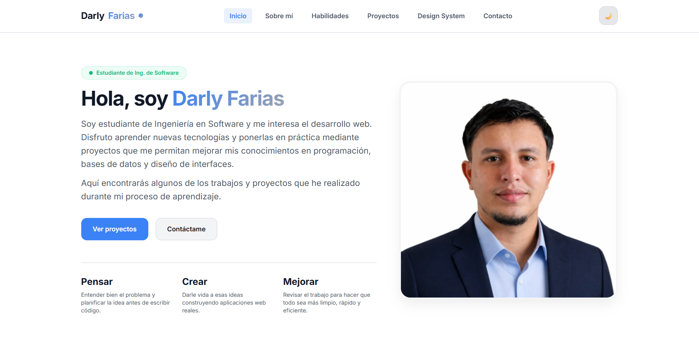
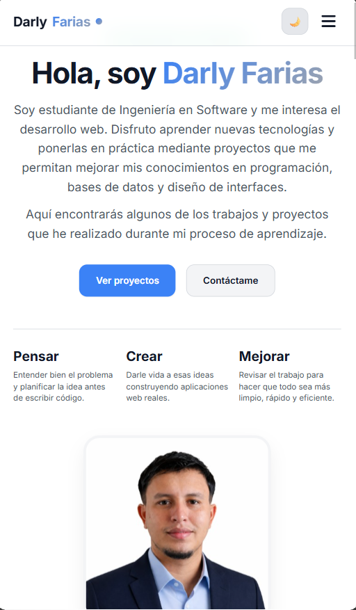

# Mi Portafolio Web - Darly Farias

## Descripción
Este proyecto corresponde a mi portafolio personal, donde presento información sobre mi formación académica, las tecnologías con las que he trabajado y algunos de los proyectos que he desarrollado durante mi aprendizaje en Ingeniería de Software.

El objetivo fue crear una página web propia que me permitiera poner en práctica conocimientos de HTML, CSS y JavaScript, además de trabajar aspectos relacionados con diseño responsivo e interacción con el usuario.

## Sitio Web
El proyecto se encuentra publicado mediante GitHub Pages y puede visualizarse en el siguiente enlace:
🔗 [https://Darly23.github.io/Portafolio-Web/](https://Darly23.github.io/Portafolio-Web/)

## Tecnologías utilizadas
- HTML5
- CSS3
- JavaScript
- Git
- GitHub

## Lo que desarrollé
Durante este proyecto trabajé en:
- Diseño adaptable para diferentes tamaños de pantalla.
- Organización de contenido mediante secciones.
- Menú de navegación interactivo.
- Modo claro y oscuro.
- Presentación de proyectos y habilidades técnicas.
- Uso de buenas prácticas en la estructura del código.

## Inspiración
Para definir el diseño visual revisé diferentes referencias de portafolios web y recursos de diseño como Stitches y Shots. Estas referencias me ayudaron a obtener ideas sobre distribución de contenido, colores y organización de la interfaz.

El diseño final fue adaptado según mis preferencias y los objetivos del proyecto.

## Instrucciones de visualización

### Opción 1: Ver el sitio publicado
Acceder al enlace de GitHub Pages:
🔗 [https://Darly23.github.io/Portafolio-Web/](https://Darly23.github.io/Portafolio-Web/)

### Opción 2: Ejecutar localmente
1. Clonar o descargar el repositorio.
2. Abrir la carpeta del proyecto.
3. Ejecutar el archivo `index.html`.
*Opcionalmente, se puede utilizar Live Server en Visual Studio Code para visualizar los cambios en tiempo real.*

## Capturas del resultado

### Vista de escritorio

### Vista móvil

## Autor
**Darly Farias**  
Estudiante de Ingeniería de Software - UNEMI
